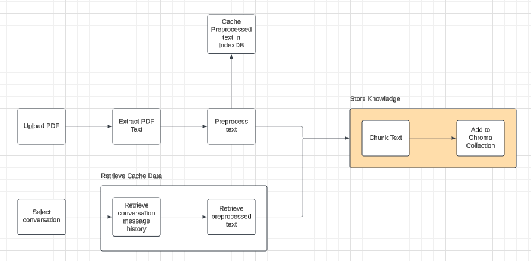
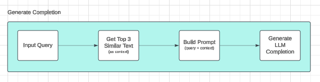

# Chatbot with RAG using Streamlit Journal

Site: https://rag-stream-232591557642.us-central1.run.app

Creating RAG applications is quite simple if you think of its basic architecture. All you need to have is a vector database, a large language model, and some embedding function. The learning curve then typically happens when a RAG chatbot is being integrated into a system, either a large codebase, or a some feature that needs a chatbot, where custom functionalities are needed. For me, I encountered a quite unorthodox problem, where the framework that was given to me lacks the capacity to handle the complex functionlities in my head.

This is the first time that I had developed using Streamlit. Moreover, this is the first time that I had created an LLM based application where the backend is not separated with the frontend. I am used to developing large scale applications, where in my previous projects and occupation, I always had to think in the big picture, like how to create UIs and APIs such that it can be easily be built upon in the future. While I was using Steamlit, I cannot envision a large scale project using the framework itself. Maybe it's because I do not have enough experience with it, and if that is the case, I am more than willing to be proven wrong.

Streamlit is really wierd since the code to render the UI in the browser is integrated in the main code itself. I feel like developing with express or flask, but in this case, I am coding the UI in the server. I also tried replicating the concept of components like in most frontend frameworks like React, but I had no time to refactor the code as I was also experimenting with other features that I can add to the main application.

Another thing is ChromaDB, I expected it to be a learning curve since the only vector database experience I had was with pgvector, a postgreSQL extension that allows vector models in the database. With Chroma's in-memory capabilities, I did not have to persist anything.

## Application RAG Logic

### Storing Knowledge Base Embeddings

  

I initially planned to create different conversations and store each corresponding message history with along with the files in the browser cache. However, I found out that caching is native to javascript, so I need to use the language's functionalities to access session storage, local storage, or indexed db. There is a workaround where I can embed javascript code into my streamlit app, but I think it is not elegant.

### Generating LLM Completion

  

This part is quite straightforward, where I retrieve the relevant similar context to the input query, augment the context with the query, and then generate a completion from an LLM, in this case, from a GPT model. 

## Deployment

The deployment is really simple. I created a Dockerfile based on a python image, where i created a custom image of my application. After that, I uploaded the locally built image into a repository in Google Cloud Artifact Registry. Once I had the image URI, I then deployed the Streamlit application into Google Cloud Run. I tried to map my a subdomain of my portfolio domain maxellmilay.com, but I had issues integrating GoDaddy with GCP since it was an experimental beta feature.

> NOTE: I have uploaded the files to GitHub and Google Drive, but I did not include the `.env` (environment variables) and `key.json` (GCP service account key)

## Takeaways

Overall, my only comment with Streamlit is that it is ideal for prototyping a data-based application, but I can't see it yet to be used in building a large software where there are multiple complex features.
